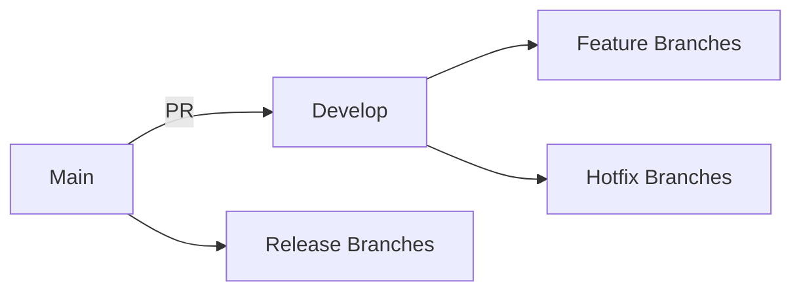

# Birthday Reminder App

A native Android application built with Kotlin and Jetpack Compose to help users track and remember important birthdays.

## Project Structure

The app follows a clean architecture pattern with three main layers:

### Data Layer (`app/src/main/java/com/birthdayreminder/data/`)
- Room database entities
- DAOs (Data Access Objects)
- Repository implementations
- Local data sources

### Domain Layer (`app/src/main/java/com/birthdayreminder/domain/`)
- Use cases (business logic)
- Repository interfaces
- Domain models
- ViewModels

### UI Layer (`app/src/main/java/com/birthdayreminder/ui/`)
- Composable screens
- Navigation setup
- UI components
- Theme and styling

## Technologies Used

- **Kotlin** - Primary programming language
- **Jetpack Compose** - Modern declarative UI framework
- **Room Database** - Local SQLite database with type-safe queries
- **Hilt** - Dependency injection framework
- **Navigation Compose** - Navigation between screens
- **WorkManager** - Background task scheduling for notifications
- **Material Design 3** - UI design system

## Dependencies

### Core Dependencies
- androidx.core:core-ktx
- androidx.lifecycle:lifecycle-runtime-ktx
- androidx.activity:activity-compose

### Compose Dependencies
- androidx.compose:compose-bom
- androidx.compose.ui:ui
- androidx.compose.material3:material3
- androidx.navigation:navigation-compose
- androidx.lifecycle:lifecycle-viewmodel-compose

### Database
- androidx.room:room-runtime
- androidx.room:room-ktx

### Dependency Injection
- com.google.dagger:hilt-android
- androidx.hilt:hilt-navigation-compose

### Background Tasks
- androidx.work:work-runtime-ktx
- androidx.hilt:hilt-work

## Requirements Addressed

This project structure addresses requirement 7.5 from the specifications:
- ✅ Android project created with Kotlin and Jetpack Compose
- ✅ Build.gradle files configured with required dependencies (Room, Hilt, Navigation Compose, WorkManager)
- ✅ Basic project structure set up with packages for data, domain, and ui layers

## Getting Started

1. Open the project in Android Studio
2. Sync the project to download dependencies
3. Build and run the app on an Android device or emulator

## Minimum Requirements

- Android API level 21 (Android 5.0)
- Target SDK: 34 (Android 14)
- Kotlin 1.9.10
- Gradle 8.2.0

## CI/CD Pipeline

This project uses an optimized GitHub Actions workflow for continuous integration and delivery.

### 🚀 Workflow Features

- **Smart Branch-Based Execution**: Different behaviors for feature, main, and release branches
- **Comprehensive Quality Checks**: Linting, ktlint, and detekt for code quality
- **Matrix Builds**: Debug and release builds with conditional execution
- **Enhanced Testing**: Unit tests + instrumented tests on emulator
- **Versioned Artifacts**: Properly named APKs with commit SHA and run number
- **Automatic Releases**: GitHub releases with auto-generated notes for main branch

### 📖 Documentation

For complete workflow documentation, see:
- **[GitHub Actions Workflow Guide](docs/github_actions_workflow.md)** - Usage instructions and technical details
- **[Implementation Summary](plans/github_actions_implementation_summary.md)** - What was changed and why
- **[Optimization Plan](plans/github_actions_optimization_plan.md)** - Original optimization strategy

### 🔧 Quick Start

1. **Feature Development**: Push to `feature/*` branches for debug builds
2. **Main Development**: Push to `develop` or `main` for full builds + tests
3. **Releases**: Push to `main`/`master` for automatic release creation
4. **Manual Trigger**: Use GitHub Actions UI for custom builds

### 📦 Artifacts

Build artifacts are automatically uploaded and named:
```
app-{build_type}-{commit_sha}-{run_number}.apk
```

Example: `app-debug-a1b2c3d-42.apk`

## Development Workflow

### Branch Strategy



### CI/CD Integration

- **Feature Branches**: Debug builds, no tests, quick feedback
- **Develop Branch**: Full builds + tests, artifact upload
- **Main Branch**: Full builds + tests + release creation
- **Release Branches**: Release builds + comprehensive testing

### Quality Gates

All builds go through:
1. ✅ Android Linting
2. ✅ Kotlin Style (ktlint)
3. ✅ Code Quality (detekt)
4. ✅ Unit Tests
5. ✅ Instrumented Tests (debug builds)

## Build Configuration

### Requirements
- JDK 17 (Temurin distribution)
- Android SDK 34
- Gradle 8.2.0
- GitHub Actions cache enabled

### Local Build

```bash
# Debug build
./gradlew assembleDebug

# Release build
./gradlew assembleRelease

# Run all tests
./gradlew test

# Run linting
./gradlew lint

# Run code quality checks
./gradlew ktlintCheck detekt
```

### CI Build

The GitHub Actions workflow handles all build types automatically based on branch strategy.