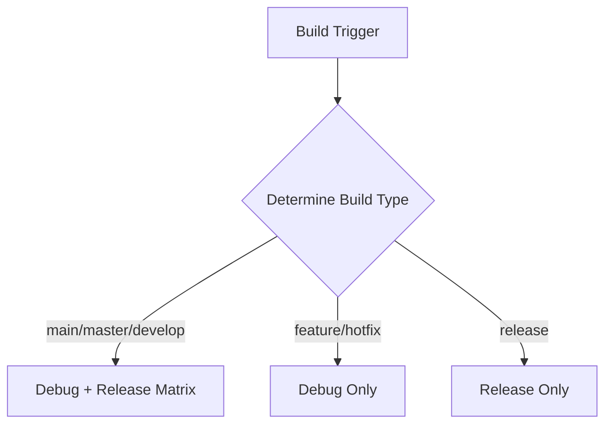
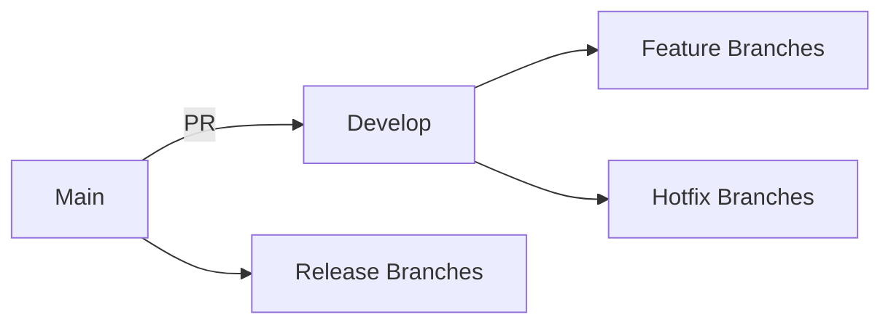

# GitHub Actions Workflow Documentation

## 🚀 Optimized Android CI/CD Pipeline

This documentation explains how the optimized GitHub Actions workflow works and how to use it effectively.

## 📁 Workflow Overview

**Location**: `.github/workflows/android.yml`

## 🎯 Workflow Features

### 1. Smart Branch-Based Execution

The workflow automatically adjusts behavior based on the branch:

| Branch Type | Build Type | Tests | Artifacts | Deployment |
|-------------|------------|-------|-----------|------------|
| `main`/`master` | Debug + Release | ✅ Full | ✅ Upload | ✅ Release |
| `develop`/`staging` | Debug + Release | ✅ Full | ✅ Upload | ❌ No |
| `feature/**` | Debug Only | ❌ No | ❌ No | ❌ No |
| `hotfix/**` | Debug Only | ❌ No | ❌ No | ❌ No |
| `release/**` | Release Only | ✅ Full | ✅ Upload | ❌ No |

### 2. Build Matrix Strategy



### 3. Quality Gates

Every build goes through comprehensive quality checks:

```yaml
# Quality Check Pipeline
1. Linting (Android best practices)
2. ktlint (Kotlin style guide)
3. detekt (Code quality analysis)
4. Unit Tests (JVM tests)
5. Instrumented Tests (Emulator tests - debug only)
```

## 🔧 How to Use the Workflow

### Automatic Triggers

The workflow runs automatically on:

- **Push events** to any tracked branch
- **Pull requests** targeting main branches
- **Manual triggers** via GitHub Actions UI

### Manual Trigger Instructions

1. **Via GitHub UI**:
   - Go to **Actions** tab
   - Select **Android CI/CD Improved** workflow
   - Click **Run workflow** dropdown
   - Choose build type and test options
   - Click **Run workflow**

2. **Via GitHub CLI**:
   ```bash
   gh workflow run android.yml \
     -f build_type=both \
     -f run_tests=true
   ```

### Build Type Options

| Option | Description | Use Case |
|--------|-------------|----------|
| `debug` | Debug build only | Feature development |
| `release` | Release build only | Production releases |
| `both` | Debug + Release | Main branches |

## 📦 Artifact Management

### Artifact Naming Convention

```
app-${build_type}-${commit_sha}-${run_number}.apk
```

**Example**: `app-debug-a1b2c3d-42.apk`

### Artifact Retention

- **Duration**: 30 days
- **Location**: GitHub Actions artifacts
- **Access**: Available in workflow run summary

### Downloading Artifacts

1. **Via GitHub UI**:
   - Go to workflow run
   - Click on **Artifacts** section
   - Download the desired APK

2. **Via GitHub CLI**:
   ```bash
   gh run download <run-id> --dir=artifacts
   ```

## 🚀 Release Process

### Automatic Releases

- **Trigger**: Push to `main` or `master` branch
- **Process**:
  1. Builds both debug and release APKs
  2. Runs all tests
  3. Uploads artifacts
  4. Creates GitHub release with auto-generated notes
  5. Attaches APKs to release

### Release Naming

```
v1.0.${github.run_number}
```

**Example**: `v1.0.42`

## 🔍 Workflow Jobs Explained

### 1. `determine-build-type` Job

**Purpose**: Analyzes branch and inputs to determine build configuration

**Outputs**:
- `build_type`: `debug`, `release`, or `both`
- `run_tests`: `true` or `false`
- `upload_artifacts`: `true` or `false`

### 2. `build-and-test` Job

**Purpose**: Executes the build matrix with quality checks

**Matrix Strategy**:
- `debug`: Assembles debug APK
- `release`: Assembles release APK

**Steps**:
1. Checkout code
2. Set up JDK 17
3. Cache Gradle dependencies
4. Validate Gradle wrapper
5. Run quality checks (lint, ktlint, detekt)
6. Build APK
7. Run tests (conditional)
8. Upload artifacts (conditional)

### 3. `deploy` Job

**Purpose**: Handles release creation and deployment

**Conditions**:
- Only runs if artifacts should be uploaded
- Only runs on main branches (`main`, `master`, `develop`, `staging`)

**Actions**:
- Downloads all artifacts
- Creates GitHub release (main/master only)
- Generates release notes automatically

### 4. `notify` Job

**Purpose**: Provides workflow status notifications

**Features**:
- Runs always (even if previous jobs fail)
- Provides formatted status messages
- Includes build details and artifact links

## 🛠️ Customization Guide

### Modifying Branch Behavior

Edit the `determine-build-type` job (lines 47-81):

```yaml
# Example: Add custom branch pattern
elif [[ "${{ github.ref_name }}" =~ ^custom/.*$ ]]; then
  BUILD_TYPE="debug"
  RUN_TESTS="true"
  UPLOAD_ARTIFACTS="false"
```

### Adding New Quality Checks

Add steps before the build step (around line 146):

```yaml
- name: Run custom quality check
  if: steps.check-build-type.outputs.should_run == 'true'
  run: ./gradlew customQualityCheck
```

### Adjusting Test Strategy

Modify test conditions (lines 150-159):

```yaml
# Example: Run tests on feature branches too
- name: Run unit tests
  if: steps.check-build-type.outputs.should_run == 'true' && (needs.determine-build-type.outputs.run_tests == 'true' || contains(github.ref_name, 'feature/'))
  run: ./gradlew testDebugUnitTest
```

## 📊 Performance Optimization

### Caching Strategy

The workflow uses multi-level caching:

1. **Gradle Cache**: Built into `setup-java` action
2. **Dependency Cache**: Explicit cache action for `~/.gradle/caches`
3. **Wrapper Cache**: Caches Gradle wrapper for faster startup

**Cache Key**: Based on Gradle files hash for proper invalidation

### Build Time Expectations

| Scenario | Expected Time | Notes |
|----------|---------------|-------|
| First run | 8-12 minutes | No cache, full setup |
| Subsequent runs | 4-6 minutes | Cache hit, faster builds |
| Feature branches | 2-3 minutes | Debug only, minimal tests |

## 🔧 Troubleshooting

### Common Issues

**1. Build fails on feature branch**
- **Cause**: Missing dependencies or configuration
- **Solution**: Check branch-specific configuration

**2. Tests failing**
- **Cause**: Test environment differences
- **Solution**: Review test logs and emulator setup

**3. Cache not working**
- **Cause**: Cache key mismatch
- **Solution**: Verify Gradle files haven't changed

### Debugging Tips

1. **View workflow logs**: Check each step's output
2. **Download artifacts**: Even if build fails, some artifacts may be available
3. **Check cache hits**: Look for cache restoration messages in logs
4. **Manual trigger**: Test with different build type options

## 📚 Best Practices

### 1. Branch Strategy



### 2. Commit Strategy

- **Feature branches**: Small, frequent commits
- **Main branches**: Squashed, meaningful commits
- **Release branches**: Version-tagged commits

### 3. Workflow Maintenance

- **Update regularly**: Keep action versions current
- **Review logs**: Monitor for deprecated features
- **Test changes**: Validate workflow updates on feature branches first

## 🔗 Related Documentation

- **Implementation Plan**: [`plans/github_actions_optimization_plan.md`](plans/github_actions_optimization_plan.md)
- **Implementation Summary**: [`plans/github_actions_implementation_summary.md`](plans/github_actions_implementation_summary.md)
- **Workflow File**: [`.github/workflows/android.yml`](.github/workflows/android.yml)

## 📞 Support

For workflow-related issues:

1. Check GitHub Actions documentation
2. Review workflow logs for specific errors
3. Consult the implementation documentation
4. Test changes on feature branches first

This optimized workflow provides a robust, modern CI/CD pipeline for Android development with comprehensive quality checks, smart branching strategy, and efficient artifact management.